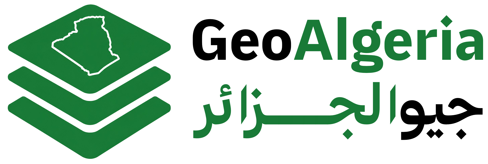

<div align="center">

[English](README.md) | **Français** | [العربية](README.ar.md)

<a href="https://geoalgeria.com"><picture><source media="(prefers-color-scheme: dark)" srcset="./assets/brand/logo/geoalgeria-logo-horizontal-white.png"></picture></a>

<sub>par</sub><br>
<a href="https://yasser.studio"><picture><source media="(prefers-color-scheme: dark)" srcset="./assets/yasser-studio-logo-white.svg"></picture></a>

**Le jeu de données ouvert pour l'Algérie — installez-le, ne le scrapez pas.**

[](https://github.com/yasserstudio/geoalgeria/actions/workflows/ci.yml)
[](https://www.npmjs.com/package/geoalgeria)
[](https://www.npmjs.com/package/geoalgeria)
[](https://www.jsdelivr.com/package/npm/geoalgeria)
[](https://github.com/yasserstudio/geoalgeria)
[](LICENSE)

</div>

La plupart des jeux de données sur l'Algérie disponibles en ligne listent encore **48 wilayas**. L'Algérie en compte **69 depuis avril 2026**. GeoAlgeria fait partie des rares jeux de données déjà mis à jour — avec les vrais codes postaux d'Algérie Poste, les coordonnées géographiques, les noms bilingues, les bureaux de poste et les DAB — livré en JSON, CSV, GeoJSON, SQL et TypeScript. Un seul `npm install`, licence MIT, validation CI automatique à chaque mise à jour.

```bash
npm install geoalgeria
```

```js
const dz = require("geoalgeria");

dz.wilayas;                       // les 69 wilayas
dz.getCommunesByWilaya(16);       // 57 communes à Alger
dz.findByPostalCode("16000");     // → commune, daïra, wilaya
dz.getPostOfficesByCommune(1731); // vrais bureaux d'Algérie Poste
```

## Contenu

| | Nombre | |
|---|---|---|
| **Wilayas** | 69 | provinces (réformes 2019 + 2026) |
| **Daïras** | 555 | districts, comme entités de premier niveau |
| **Communes** | 1 528 | bilingues FR/AR, codes postaux, coordonnées |
| **Bureaux de poste** | 3 908 | vrais codes Algérie Poste, coordonnées |
| **DAB** | 2 026 | réseau GAB d'Algérie Poste |
| **Agences d'emploi** | 331 | ANEM : 58 AWEM + 273 ALEM — [`@geoalgeria/emploi`](packages/emploi) |
| **Réseau Mobilis** | 12 345 | 165 agences + 12 180 points de vente — [`@geoalgeria/mobilis`](packages/mobilis) |
| **Couverture 5G** | 1 681 | sites 5G Djezzy + Mobilis + Ooredoo — [`@geoalgeria/telecom`](packages/telecom) |
| **Aéroports civils** | 33 | ANAC : noms, codes OACI, contacts, coordonnées — [`@geoalgeria/aviation`](packages/aviation) |
| **Banques et agences** | 1 704 | les 21 banques agréées + 8 institutions ; agences avec codes RIB/SWIFT, propriété, coordonnées — [`@geoalgeria/banques`](packages/banques) |
| **Transporteurs de livraison** | 411 | 16 transporteurs + 411 bureaux de retrait géocodés dans 61 wilayas (Yalidine, Guepex, Anderson, Noest, Maystro) — [`@geoalgeria/livraison`](packages/livraison) |
| **Établissements de jeunesse** | 2 334 | maisons de jeunes, complexes sportifs de proximité, salles polyvalentes, auberges, centres culturels et plus dans 58 wilayas (Ministère de la Jeunesse et des Sports) — [`@geoalgeria/jeunesse`](packages/jeunesse) |
| **Installations sportives** | 5 141 | stades, piscines, terrains de proximité, pistes d'athlétisme, terrains de sport et plus (27 types) dans 58 wilayas (Ministère de la Jeunesse et des Sports) — [`@geoalgeria/sports`](packages/sports) |
| **Enseignement supérieur** | 177 | universités, grandes écoles, ENS, centres + 19 établissements privés et 48 relevant d'autres ministères dans 51 wilayas, avec sites web officiels (MESRS) — [`@geoalgeria/enseignement-superieur`](packages/enseignement-superieur) |
| **Tourisme** | 4 348 | 995 hôtels, 1 248 attractions, 1 184 sites historiques, 282 sources thermales (ASAL), 32 parcs nationaux — [`@geoalgeria/tourisme`](packages/tourisme) |
| **Formation professionnelle** | 1 932 | 856 CFPA + 182 INSFP + 723 établissements privés agréés + 58 DFEP + plus dans 58 wilayas (MFEP / takwin.dz) — [`@geoalgeria/formation-professionnelle`](packages/formation-professionnelle) |
| **Mosquées** | 20 759 | composite Wikidata + OpenStreetMap — noms arabes & français, dénomination, les 69 wilayas — [`@geoalgeria/mosquees`](packages/mosquees) |
| **Boutiques Djezzy** | 128 | points de vente géolocalisés avec catégorie, horaires et rattachement commune/wilaya (djezzy.dz) — [`@geoalgeria/djezzy`](packages/djezzy) |
| **Établissements de santé** | 695 | EPH · EPSP · EHS · CHU du Ministère de la Santé — bilingues, 600 géolocalisés via OSM + Wikidata — [`@geoalgeria/sante`](packages/sante) |

Formats : **JSON · CSV · GeoJSON · SQL · TypeScript**. Le paquet npm contient le JSON pour rester léger ; les CSV/GeoJSON/SQL sont dans chaque [release GitHub](https://github.com/yasserstudio/geoalgeria/releases).

> À jour avec la **Loi n° 26-06** (nouvelle organisation territoriale), [*Journal Officiel* n° 25 du 5 avril 2026](https://www.joradp.dz/FTP/jo-francais/2026/F2026040.pdf) — ainsi que la réforme de 2019 (Loi 19-12).

## Pourquoi GeoAlgeria ?

| | geoalgeria | leblad | algeria-cities |
|---|:---:|:---:|:---:|
| Les 69 wilayas (réforme 2026) | ✅ | ❌ (58) | ✅ |
| Daïras comme entités à part entière | ✅ | ❌ | ❌ |
| Vrais codes postaux Algérie Poste | ✅ | ~ | ❌ |
| Coordonnées par commune | ✅ | ❌ | ✅ |
| Bureaux de poste et DAB | ✅ | ❌ | ❌ |
| Prêt pour le e-commerce (plat) | ✅ | ❌ | ❌ |
| npm + types TypeScript | ✅ | ✅ | ❌ |
| Exports GeoJSON / SQL | ✅ | ❌ | ✅ |
| Validation CI à chaque mise à jour | ✅ | ❌ | ❌ |
| Dernière mise à jour | **2026** | 2021 | 2023 |

[Voir la comparaison complète →](https://geoalgeria.com/compare)

## À qui ça s'adresse

- **E-commerce / COD** — cascades d'adresses wilaya → daïra → commune, validation des codes postaux et configuration des zones de livraison correspondant à ce que les transporteurs utilisent réellement.
- **Cartes et SIG** — GeoJSON prêt à l'emploi avec 1 528 features communes, modélisé correctement à travers les deux réformes.
- **Recherche, données publiques et projets civiques** — données de référence propres, structurées, sourcées et versionnées au lieu de PDF.
- **Tout projet utilisant des données algériennes** — un seul install, types inclus.

## Paquets

| Paquet | npm | Description |
| --- | --- | --- |
| [`packages/dataset`](packages/dataset) | [`geoalgeria`](https://www.npmjs.com/package/geoalgeria) | Wilayas, daïras, communes + données postales consolidées |
| [`packages/poste`](packages/poste) | [`@geoalgeria/poste`](https://www.npmjs.com/package/@geoalgeria/poste) | Bureaux de poste et DAB d'Algérie Poste |
| [`packages/emploi`](packages/emploi) | [`@geoalgeria/emploi`](https://www.npmjs.com/package/@geoalgeria/emploi) | Agences d'emploi (AWEM + ALEM) de l'ANEM |
| [`packages/mobilis`](packages/mobilis) | [`@geoalgeria/mobilis`](https://www.npmjs.com/package/@geoalgeria/mobilis) | Agences Mobilis et points de vente agréés |
| [`packages/telecom`](packages/telecom) | [`@geoalgeria/telecom`](https://www.npmjs.com/package/@geoalgeria/telecom) | Couverture 5G multi-opérateurs (Djezzy, Mobilis, Ooredoo) |
| [`packages/aviation`](packages/aviation) | [`@geoalgeria/aviation`](https://www.npmjs.com/package/@geoalgeria/aviation) | Aéroports civils de l'ANAC — noms, codes OACI, coordonnées |
| [`packages/banques`](packages/banques) | [`@geoalgeria/banques`](https://www.npmjs.com/package/@geoalgeria/banques) | Les 21 banques agréées + institutions financières et 1 704 agences (RIB, SWIFT, propriété, coordonnées) |
| [`packages/livraison`](packages/livraison) | [`@geoalgeria/livraison`](https://www.npmjs.com/package/@geoalgeria/livraison) | Registre des transporteurs + 411 bureaux de retrait géocodés et couverture par transporteur (Yalidine, Guepex, Anderson, Noest, Maystro) |
| [`packages/jeunesse`](packages/jeunesse) | [`@geoalgeria/jeunesse`](https://www.npmjs.com/package/@geoalgeria/jeunesse) | Établissements de jeunesse du Ministère de la Jeunesse et des Sports (2 334 dans 58 wilayas) |
| [`packages/sports`](packages/sports) | [`@geoalgeria/sports`](https://www.npmjs.com/package/@geoalgeria/sports) | Installations sportives du Ministère de la Jeunesse et des Sports — 5 141 dans 58 wilayas, 27 types, avec capacité, accessibilité PMR et coordonnées |
| [`packages/enseignement-superieur`](packages/enseignement-superieur) | [`@geoalgeria/enseignement-superieur`](https://www.npmjs.com/package/@geoalgeria/enseignement-superieur) | Réseau de l'enseignement supérieur du MESRS — universités, grandes écoles, ENS et centres + 19 établissements privés et 48 relevant d'autres ministères (177), avec sites web officiels et coordonnées |
| [`packages/tourisme`](packages/tourisme) | [`@geoalgeria/tourisme`](https://www.npmjs.com/package/@geoalgeria/tourisme) | Infrastructure touristique — 4 348 hôtels, attractions, sites historiques, sources thermales et parcs géocodés (ASAL, OSM, Wikidata) |
| [`packages/formation-professionnelle`](packages/formation-professionnelle) | [`@geoalgeria/formation-professionnelle`](https://www.npmjs.com/package/@geoalgeria/formation-professionnelle) | Formation professionnelle — 1 932 CFPA, INSFP, IFEP, IEP, DFEP et centres privés du MFEP (takwin.dz), avec capacité, internat et coordonnées |
| [`packages/djezzy`](packages/djezzy) | [`@geoalgeria/djezzy`](https://www.npmjs.com/package/@geoalgeria/djezzy) | Boutiques Djezzy — 128 points de vente géolocalisés de djezzy.dz, avec catégorie, horaires et rattachement commune/wilaya |
| [`packages/mosquees`](packages/mosquees) | [`@geoalgeria/mosquees`](https://www.npmjs.com/package/@geoalgeria/mosquees) | Mosquées d'Algérie — 20 759 géolocalisées, un composite Wikidata + OpenStreetMap avec noms arabes & français, dénomination et rattachement commune/wilaya |
| [`packages/sante`](packages/sante) | [`@geoalgeria/sante`](https://www.npmjs.com/package/@geoalgeria/sante) | Établissements de santé publics — 695 du Ministère de la Santé (EPH, EPSP, EHS, CHU), bilingues, géolocalisés via OSM + Wikidata avec rattachement commune/wilaya |

[Parcourir tous les paquets →](https://geoalgeria.com/data) · [Documentation API et référence des champs →](https://geoalgeria.com/data/docs)

## Utilisation sans npm

```html
<!-- via le CDN jsDelivr, sans installation -->
<script>
  fetch("https://cdn.jsdelivr.net/npm/geoalgeria/data/ecommerce/communes.json")
    .then((r) => r.json())
    .then((communes) => { /* construisez votre menu déroulant */ });
</script>
```

Vous préférez les fichiers ? Téléchargez les **CSV / GeoJSON / SQL** depuis le bundle zippé de n'importe quelle [release GitHub](https://github.com/yasserstudio/geoalgeria/releases), ou parcourez [`packages/dataset/data/`](packages/dataset/data).

## La suite

GeoAlgeria n'est pas un export ponctuel. L'objectif est de devenir **la** source de référence ouverte et continuellement mise à jour pour les données algériennes — maintenue à jour à travers chaque réforme administrative, et **s'étendant à d'autres types de données au fur et à mesure que les sources deviennent disponibles**. Les divisions administratives et les données postales/bancaires ne sont que le début.

Suivez ou mettez une ⭐ au repo, et [ouvrez une discussion](https://github.com/yasserstudio/geoalgeria/discussions) pour demander un jeu de données.

## Contribuer

Les corrections et ajouts sont les bienvenus — voir [CONTRIBUTING.md](CONTRIBUTING.md). Les bonnes premières contributions nécessitent généralement juste un lien source ou une coordonnée de commune manquante. Des données incorrectes ? [Ouvrez une issue](https://github.com/yasserstudio/geoalgeria/issues/new/choose).

## Versionnage et releases

Versionnage sémantique par paquet, automatisé avec [Changesets](https://github.com/changesets/changesets). Voir [`RELEASING.md`](RELEASING.md) et le `CHANGELOG.md` de chaque paquet.

## Sponsoriser

GeoAlgeria est gratuit et MIT. Si ça vous fait gagner du temps, [**sponsorisez sa maintenance**](https://github.com/sponsors/yasserstudio) — ça finance la mise à jour des données et l'extension de la couverture.

## Licence et avertissement

**Code :** [MIT](LICENSE). **Données :** compilées à partir de sources officielles publiques (le *Journal Officiel*, Algérie Poste, ANEM, ANAC, le site public de chaque opérateur/institution) et redistribuées pour référence.

GeoAlgeria est un **projet indépendant — non affilié ni soutenu par** aucun organisme gouvernemental, régulateur, opérateur ou institution qu'il référence ; leurs noms et marques appartiennent à leurs propriétaires respectifs. Les données sont fournies **« en l'état », sans garantie — vérifiez auprès de la source officielle** avant de vous y fier, notamment pour les usages financiers, de paiement, KYC ou de conformité. Conditions complètes : **[DISCLAIMER](DISCLAIMER.md)**.

---

<div align="center">

Si GeoAlgeria vous a évité de copier-coller des wilayas depuis un PDF, **[mettez-lui une ⭐](https://github.com/yasserstudio/geoalgeria)** — ça aide le prochain développeur algérien à trouver des données propres.

<a href="https://yasser.studio"><picture><source media="(prefers-color-scheme: dark)" srcset="./assets/yasser-studio-logo-white.svg"></picture></a>

Fait par [Yasser's Studio](https://yasser.studio) · [geoalgeria.com](https://geoalgeria.com) · [LinkedIn](https://www.linkedin.com/in/yasserberrehail/) · [X](https://x.com/yassersstudio) · [hello@yasser.studio](mailto:hello@yasser.studio)

</div>
